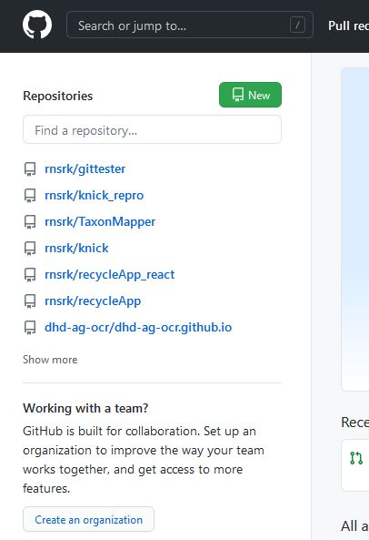
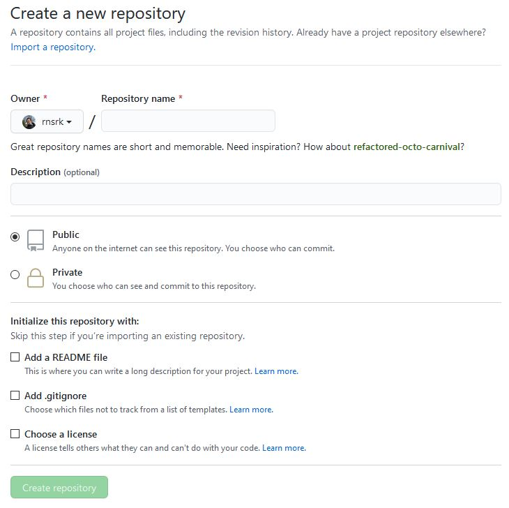
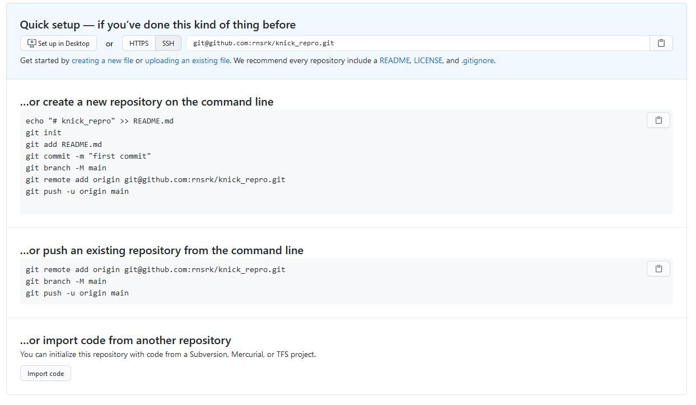
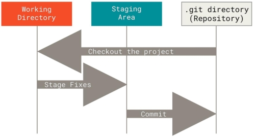

# Knick *Git und Docker*

## Software installieren
- Terminal öffnen: strg + shift + t

### Git
~~~shell
sudo apt install git -y
~~~

### Docker
#### Normales Docker
- evtl. alte versionen deinstallieren
~~~shell
sudo apt remove docker docker-engine docker.io containerd runc
~~~
- Paketquellen updaten
~~~shell
sudo apt update
~~~shell
sudo apt install apt-transport-https ca-certificates curl gnupg-agent software-properties-common
~~~
- GPG key installieren
~~~shell
curl -fsSL https://download.docker.com/linux/ubuntu/gpg | sudo apt-key add -
~~~
- Package-Repro hinzufügen
~~~shell
sudo add-apt-repository "deb [arch=amd64] https://download.docker.com/linux/ubuntu $(lsb_release -cs) stable"
~~~
- Docker installieren
~~~shell
sudo apt update
sudo apt install docker-ce docker-ce-cli containerd.io
~~~

- Benutzer:in zur Docker-Gruppe hinzufügen (Docker ohne sudo starten können)
~~~shell
sudo groupadd docker # erstellt Docker-Gruppe
sudo usermod -aG docker $USER # fügt Benutzer:in der Gruppe hinzu
$ newgrp docker # aktiviert die Gruppe
~~~
- Testen
~~~shell
sudo docker run hello-world
~~~

#### Docker-compose zu Orchestrierung mehrerer Container
- docker-compose holen
~~~shell
sudo curl -L "https://github.com/docker/compose/releases/download/1.27.4/docker-compose-$(uname -s)-$(uname -m)" -o /usr/local/bin/docker-compose
~~~
- ausführbar machen
~~~shell
sudo chmod +x /usr/local/bin/docker-compose
~~~
- (evtl. linken)
~~~shell
sudo ln -s /usr/local/bin/docker-compose /usr/bin/docker-compose
~~~

## Schnellstart

- Im Terminal einen Ordner erstellen und hineinwechseln
~~~shell
mkdir ~/git #erstellt einen neuen Ordner in Eurem Homeverzeichnis
cd ~/git
~~~
- Mein Test Repro klonen
~~~shell
git clone https://github.com/rnsrk/knick.git
~~~
- Ins Verzeichnis wechseln
~~~shell
cd knick
~~~
- Docker-compose ausführen
~~~shell
docker-compose up
~~~

## Git

### Neues Repro erstellen

- [github](https://github.com) Account?  

- auf github eine Repro erstellen   
    * Repositories _new_
    * 
    * Einstellungen festlegen
    * 
    * Übersicht initiale Kommandos
    * 

### Erste Schritte
- Im Terminal einen Ordner erstellen und hineinwechseln
~~~shell
mkdir ~/git #erstellt einen neuen Ordner in Eurem Homeverzeichnis
cd ~/git
~~~
- eine intitiale Datei erstellen
~~~shell
echo "# knick_repro" >> README.md
~~~
- Git inititialisieren
~~~shell
git init
~~~
- *stagen* : Diese Datei soll der Versionierung hinzugefügt werden
~~~shell
git add README.md
~~~
- *committen* : Dieser Stand soll der Versionierung mitgeteilt werden
~~~shell
git commit -m "first commit"
~~~
- *branching*: Dieser Commit soll diesem Entwicklungszweig zugeteilt werden
~~~shell
git branch -M main
~~~
- *remote repository*: Dieser Branch soll diesem Reporisory zugeteilt werden
~~~shell
git remote add origin https://github.com/rnsrk/knick_repro.git
~~~
- *pushen*: Alle Commits sollen auf das Repository geladen werden
~~~shell
git push -u origin main
~~~

#### Erklärung

## Docker

